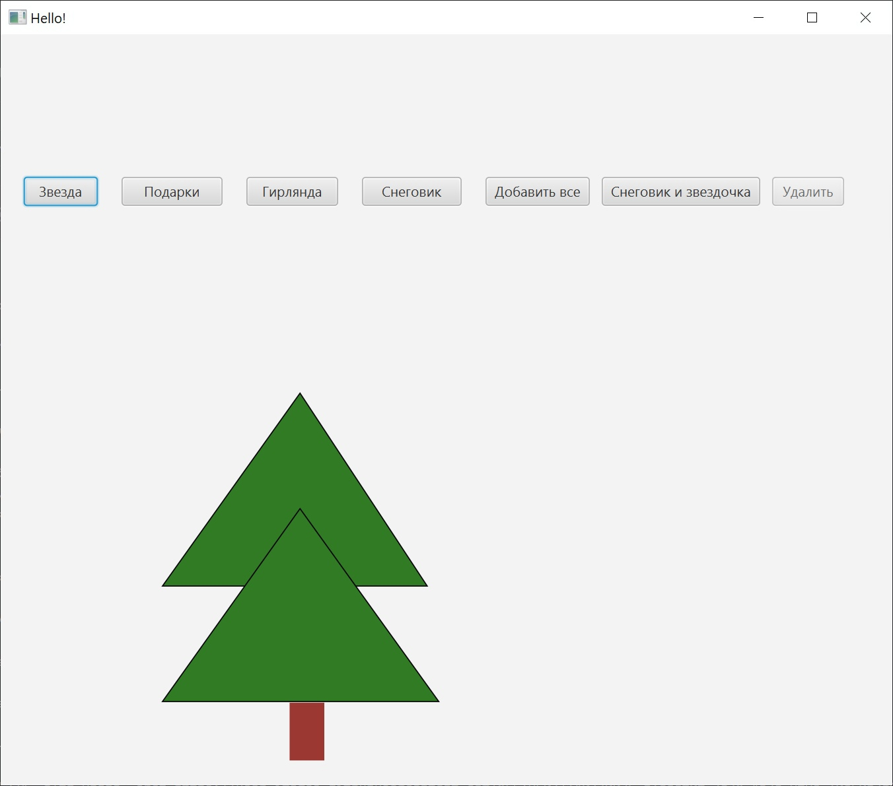

# Декоратор

Приложение с реализацией паттерна Декоратор.

**Описание**
---
Это приложение, в котором можно, декорировать елку в соответствие с выбором пользователя

**Функционал приложения:**

- Кнопка выбора различных элементов декорирования
- Кнопка очистки 
- Кнопка для добавления всех элементов сразу

**Технология**
---
Язык программирования Java.

Скриншот главного окна 
---

Скриншот работы кнопки звезда
---

Скриншот работы кнопки "Дабавить все"
---

